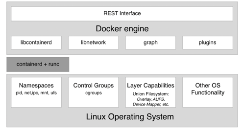

## Container Architecture
### Container Architecture Diagram
1. following diagram illustrates  what a computer that Docker has been installed on looks like
   
2. There are three main architectural components
    1. On the bottom, we have the `Linux Operating System`
    2. In the middle, in the dark gray, we have the container runtime
    3. On the top, we have the `Docker Engine`
3. Containers are only possible due to the fact that the `Linux OS` provides some primitives, such as `namespaces, control groups, layer capabilities` and `more all of which are leveraged in a very specific way by the container runtime and the Docker engine`
4. Linux kernel namespaces, such as `process ID (pid) namespaces` or `network (net)` namespaces, allow Docker to encapsulate or sandbox processes that run inside the container
5. `Control Groups` make sure that the containers cannot suffer from noisy-neighbours syndrome, where a single application running in a container can consume most or all of the available resources of the whole Docker host
6. `Control Groups` allows Docker to limit the resources, such as CPU time or the amount of RAM, that each container is allocated
7. `Container runtime` is responsible for the whole life cycle of the container.
    1. It pulls a container image from a registry, creates a container from that image, initializes and runs the container, and eventually stops and removes the container from the system when asked
8. `Docker engine` provides additional functionality on top of the container runtime, such as network libraries or support for plugins
    1. It also provides a `REST` interface over which all container operations can be automated
    2. Docker command-line interface is one of the consumers of this REST interface

