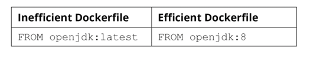

author: Arun Tiwari
summary: Docker Workshop 
id: lab5
layout: page
title: "Docker Workshop"
permalink: /labs/docker-beginner
categories: codelab,markdown
environments: Web
status: Published
feedback link: https://github.com/arunstiwari/docker-workshop-lab
analytics account: Google Analytics ID

# Multistage Dockerfiles   

## Multistage Dockerfiles
Duration: 0:07:00
### What is multistage docker files
1. `Multistage Dockerfile` is preferable when we want to optimize the Docker image sie while running Docker images in production environments 
2. Before `multistage Dockerfile`, `builder`  pattern was used to optimize the Docker image size. However in the builder pattern, we required two `Dockerfiles` and a a shell script to create efficient Docker images 

### Normal Docker builds 
1. Let us deploy a `hello world application` written in Golang using the following `Dockerfile`
```shell
# Start from the latest golang parent
FROM golang:latest
# Set the working directory
WORKDIR /myapp
# Copy source file from current directory to container
COPY helloworld.go .
# Build the application
RUN go env -w GO111MODULE=off && go build -o helloworld .
# RUN the application
ENTRYPOINT ["./helloworld"]
```
2. Let us create the `helloworld.go` file in the same directory
```shell
package main
import "fmt"
func main() {
    fmt.Println("Hello, world!")
}
```
3. Next let us build the docker image using the following command
```shell
$ docker image build -t helloworld:v1
```
4. `docker image ls` command to see the imgae list   
```shell
$ docker image ls 
REPOSITORY       TAG       IMAGE ID       CREATED         SIZE
helloworld       v1        b3183108766a   4 minutes ago   807MB
```
5. We can see that the image size is `807MB` and such large image size is not efficient as it takes a lot of time and bandwidth to be pushed and pulled over networks 
6. Smaller `docker images` are more efficient
7. Apart from the size, smaller images have less surface area from security vulnerabilities point of view 


## Exercise - Building a Docker Image with Normal Build Process 
### Exercise 1 
1. Dockerize a simple Golang application. You are provided with the Golang source code file, and your task is to compile and run this file. 

### Solution 1: 
1. Step 1:
   1. Create  a file named `welcome.go` with the following content
   ```shell
    package main
    import "fmt"
    func main() {
       fmt.Println("Welcome to multi-stage Docker builds")
    }
    ```
2. Step 2:
   1. Create a `Dockerfile` with the following content
   ```shell
    # Start from the latest golang parent
    FROM golang:latest
    # Set the working directory
    WORKDIR /myapp
    # Copy source file from current directory to container
    COPY welcome.go .
    # Build the application
    RUN go env -w GO111MODULE=off && go build -o welcome .
    # RUN the application
    ENTRYPOINT ["./welcome"]
    ```
3. Step 3:
   1. Build the docker image using the following command
   ```shell
    $ docker build -t welcome:v1 .
    ```
   2. View the image using the following command
   ```shell
    $ docker image ls 
   REPOSITORY       TAG       IMAGE ID       CREATED          SIZE
    welcome          v1        95466bbd3fda   27 seconds ago   807MB

    ```
## multistage Dockerfile
### Structure of multi-stage Dockerfile
1. Let us modify the `Dockerfile` with the following content
```shell
# Start from the latest golang parent
FROM golang:latest
# Set the working directory
WORKDIR /myapp
# Copy source file from current directory to container
COPY welcome.go .
# Build the application
RUN go env -w GO111MODULE=off && go build -o welcome .

# Start from latest alpine parent image
FROM alpine:latest
# Set the working directory
WORKDIR /myapp

#Copy welcome app from current directory to container
COPY --from=0 /myapp/welcome .
# RUN the application
ENTRYPOINT ["./welcome"]
```
2. Main difference between a normal Dockerfile and a multi-stage Dockerfile is that a multi-stage Dockerfile will use multiple FROM directives to build each phase 
3. Each new phase will start with a new parent image and does not contain anything from the previous image other than the selectively copied executables 
4. `COPY --from=0` is used to copy the executable from the first stage to the second stage 
5. Build the docker image and tag the image as `multi-stage:v1` using the following command
```shell
$ docker image build -t multi-stage:v1 .
[+] Building 4.3s (15/15) FINISHED                                                                                                                       
 => [internal] load build definition from Dockerfile                                                                                                0.0s
 => => transferring dockerfile: 531B                                                                                                                0.0s
 => [internal] load .dockerignore                                                                                                                   0.0s
 => => transferring context: 2B                                                                                                                     0.0s
 => [internal] load metadata for docker.io/library/alpine:latest                                                                                    4.1s
 => [internal] load metadata for docker.io/library/golang:latest                                                                                    4.1s
 => [auth] library/golang:pull token for registry-1.docker.io                                                                                       0.0s
 => [auth] library/alpine:pull token for registry-1.docker.io                                                                                       0.0s
 => [stage-0 1/4] FROM docker.io/library/golang:latest@sha256:c72fa9afc50b3303e8044cf28fb358b48032a548e1825819420fd40155a131cb                      0.0s
 => [internal] load build context                                                                                                                   0.0s
 => => transferring context: 133B                                                                                                                   0.0s
 => CACHED [stage-1 1/3] FROM docker.io/library/alpine:latest@sha256:21a3deaa0d32a8057914f36584b5288d2e5ecc984380bc0118285c70fa8c9300               0.0s
 => [stage-1 2/3] WORKDIR /myapp                                                                                                                    0.0s
 => CACHED [stage-0 2/4] WORKDIR /myapp                                                                                                             0.0s
 => CACHED [stage-0 3/4] COPY welcome.go .                                                                                                          0.0s
 => CACHED [stage-0 4/4] RUN go env -w GO111MODULE=off && go build -o welcome .                                                                     0.0s
 => [stage-1 3/3] COPY --from=0 /myapp/welcome .                                                                                                    0.0s
 => exporting to image                                                                                                                              0.0s
 => => exporting layers                                                                                                                             0.0s
 => => writing image sha256:da10eb9af3058a050e47c056eff62f5d9183f36b075ed24dc3556b23d7cfcb47                                                        0.0s
 => => naming to docker.io/library/multi-stage:v1                           
```
6. Let us list the image using the following command
```shell
$ docker image ls 
REPOSITORY       TAG       IMAGE ID       CREATED          SIZE
multi-stage      v1        da10eb9af305   40 seconds ago   7.17MB
welcome          v1        95466bbd3fda   21 hours ago     807MB

```
7. We can see that the size of the image has reduced significantly. 
8. `Note: ` By default, the stages in the multi-stage `Dockerfile` are referred to by an integer number, starting with 0 from the first stage. 
   1. These stages can be named to increase readability and maintainability by adding `AS <NAME> ` to the `FROM` directive. 
9. Let us modify the `Dockerfile` with the improvement 
```shell
# Start from the latest golang parent
FROM golang:latest AS builder
# Set the working directory
WORKDIR /myapp
# Copy source file from current directory to container
COPY welcome.go .
# Build the application
RUN go env -w GO111MODULE=off && go build -o welcome .

# Start from latest alpine parent image
FROM alpine:latest AS runtime
# Set the working directory
WORKDIR /myapp

#Copy welcome app from current directory to container
COPY --from=builder /myapp/welcome .
# RUN the application
ENTRYPOINT ["./welcome"]
```
10. While building a multi-stage Dockerfile, there might be instances where you want to build only up to a specific build stage. 
    1. Let us consider that your Dockerfile has two stages
    2. First stage is to build the development stage and contains all the build and debug tools
    3. Second stage is to build the production image that will contain only the runtime tools 
    4. During the code development phase of the project, you might only need to build up to the development stage to test and debug your code whenever necessary.
    5. In this scenario, you can use the --target flag with the docker build command to specify an intermediate stage as the final  stage for the resulting image 
    ```shell
    $ docker image build --target builder -t multi-stage-dev:v1 .
    ```
    6. In this execution, we used the `--target builder` flag to stop the build at the builder stage. 

## Exercise 
### Build a Docker image with a multi-stage Docker Build 
1. Create a new directory named `multi-stage`
```shell
$ mkdir multi-stage 
```
2. Navigate to the new directory `multi-stage`
```shell
$ cd multi-stage 
```
3. Within the `multi-stage` directory, create a file named `welcome.go`
```shell
$ touch welcome.go
```
4. Add the following content in the `welcome.go` file and save it
```shell
package main
import "fmt"
func main() {
   fmt.Println("Welcome to multi-stage Docker builds")
}
```
5. Create a `Dockerfile` with the following content
```shell
# Start from the latest golang parent
FROM golang:latest AS builder
# Set the working directory
WORKDIR /myapp
# Copy source file from current directory to container
COPY welcome.go .
# Build the application
RUN go env -w GO111MODULE=off && go build -o welcome .

# Start from latest alpine parent image
FROM scratch AS runtime
# Set the working directory
WORKDIR /myapp

#Copy welcome app from current directory to container
COPY --from=builder /myapp/welcome .
# RUN the application
ENTRYPOINT ["./welcome"]
```
6. Build the docker image using the following command
```shell
$ docker build -t welcome-optimized:v1 .
```
7. See the list of the Docker images using the following command
```shell
$ docker image ls 
REPOSITORY          TAG       IMAGE ID       CREATED          SIZE
welcome-optimized   v1        0777c4278e21   9 seconds ago    1.84MB
multi-stage         v1        da10eb9af305   24 minutes ago   7.17MB
```
8. We can see that image size has further decreased 

## Dockerfile Best Practices 
### Dockerfile Best Practices 
1. Using an appropriate Parent image 
   1. Use official images from the Docker Hub as the parent image. Officical images ensure that all the best practices are followed, documentation is available and security patches are applied 
   2. e.g
   3. 
   
2. Avoid using the `latest` tag for the parent image when building Docker images for production environments
   1. Best practice is to use a specific versioned tag as the parent image as shown below
    

3. Use the minimal version of the parent image 
   1. This helps in having a minimal-sized Docker image 
   2. Most of the official Docker images in Docker Hub have a minimal-sized image built around the Alpine Linux image
   3. 

4. Using a Non-Root user for Better Security 
   1. By default, Docker containers run with the root (id=0) user. 
   2. This allows the user to perform all the necessary administrative activities, such as changing system configurations, installing packages, and binding to privileged ports 
   3. So from security point of view, running the Docker container with root privilege is not at all a good idea 
   4. Run the container as a non-root user which also adheres to the principle of least privilege, and ensures that the application has only the bare minimum privileges to perform its tasks 
   5. We can use two methods to run the container as a non-root user
      1. Use the `--user (or -u)` flag
      ```shell
       $ docker run --user=9999 ubuntu:focal 
      ```
      2. In the preceding command, we have specified the user ID as 9999. If we are specifying the user as an ID, the corresponding user does not have to be available in the Docker container 
      3. Use the `USER` directive, as shown in Dockerfile below 
      ```shell
      FROM ubuntu:focal 
      RUN apt-get update
      RUN useradd demo-user 
      USER demo-user
      CMD whoami 
      ```
      4. In the preceding command, we have used the `USER` directive to set the default user to `demo-user` 

5. Using dockerignore 
   1. The .dockerignore file is a special text file within the Docker context that is used to specify a list of files to be excluded from the Docker context while building the Docker image
   2. Once we execute the `docker build` command, the Docker client will package the entire build context as a TAR archive and upload it to the Docker daemon
   3. When we execute the `docker build` command, the first line of the output is `Sending build context to the Docker daemon` which indicates that the Docker client is uploading the build context to the Docker daemon 
   4. Let us look at the sample .dockerignore file content 
   ```shell
   PASSWORDS.txt 
   tmp/
   *.md 
   !README.md
    ```
6. Minimizing Layers 
   1. Create a few layers as possible. This can be done by merging the multiple `RUN` instructions in a single line within Dockerfile 

7. Don't Install Unnecessary Tools
   1. Not installing unnecessary debugging tools (such as vim, curl, and telnet) and removing unnecessary dependencies can help create efficient Docker images that are small in size 
   2. Some package managers like `apt` will install recommended  and suggested packages automatically alongside required packages. 
   3. We can avoid this by specifying the `no-install-recommends` flag with the `apt-get install` command as shown below , which can easily reduce the final image size by 10MB 
   ```shell
    FROM ubuntu:focal 
   RUN apt-get update && apt-get install --no-install-recommends -y nginx 
    ```
   4. In addition to using the `no-install-recommends` flag, we can also remove the cache of the `apt` package manager to further reduce the final `Docker` image size 
   5. This can be achieved by running the following command 
   ```shell
    FROM ubuntu:focal 
   RUN apt-get update && apt-get install --no-install-recommends -y nginx && rm -rf /var/lib/apt/lists/*
    ```
## Exercise -  Deploy a Golang HTTP server with a multi-stage Docker Build
### Deploy a Golang HTTP server
1. We are required to deploy a Golang HTTP server to a Docker container. Your manager has asked you to build a minimal-sized Docker image and observe the best practices while building the `Dockerfile`
2. Golang HTTP server will return different response based on the invoke URL: 
3. 

### Solution 
1. Create a `main.go` file with the following content
```go
package main
import (
  "net/http"
  "fmt"
  "log"
  "os"
)

func main() {
   http.HandleFunc("/", defaultHandler)
   http.HandleFunc("/contact", contactHandler)
   http.HandleFunc("/login", loginHandler)
   port := os.Getenv("PORT")
   if port == "" {
     port = "8080"
   }
   log.Println("Service started on port "+ port)

   err := http.ListenAndServe(":"+port, nil)
   if err != nil {
     log.Fatal("ListenAndServe: ",err)
     return
   }
}

func defaultHandler(w http.ResponseWriter, r *http.Request){
  fmt.Fprintf(w,"<h1>Home Page</h1>")
}

func contactHandler(w http.ResponseWriter, r *http.Request){
  fmt.Fprintf(w,"<h1>Contact Us</h1>")
}

func loginHandler(w http.ResponseWriter, r *http.Request){
  fmt.Fprintf(w,"<h1>Login Page</h1>")
}
```
2. Create a `Dockerfile` with the following content
```shell
# Start from the latest golang parent
FROM golang:1.14.2-alpine AS builder
# Set the working directory
WORKDIR /myapp
# Copy source file from current directory to container
COPY main.go .
# Build the application
RUN go env -w GO111MODULE=off && go build -o main .

# Start from latest alpine parent image
FROM alpine:latest AS runtime
# Set the working directory
WORKDIR /myapp

#Copy welcome app from current directory to container
COPY --from=builder /myapp/main .
# RUN the application
ENTRYPOINT ["./main"]
EXPOSE 8080
```
3. Next build the docker image using the following command
```shell
$  docker build -t exercise-04:v2 .
```
4. Next run the container using the following command
```shell
$ docker container run --rm -p 8900:8080 --name exercise-04-container exercise-04:v2
```
5. Next open the browser `http://localhost:8900` and then various context like `/login` and `/contact` 