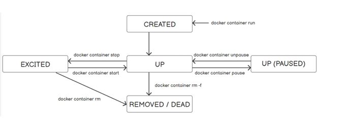

## Docker Storage
### Storage Types 
1. Two types of data storage in Docker  - local storage and second is persistent storage
2. Local storage
   1. This storage is tightly coupled to the container lifecycle
   2. If the container is removed, the files on that storage type are also removed and cannot be retrieved
   3. These files are stored in the thin read/write layer inside the container itself
   4. This type of storage is also known as `local storage`, `graphdriver storage` and the `storage driver`
3. Persistent storage
   1. Data that requires to be persisted beyond the lifecycle of the container is stored in the `persistent storage`
4. The container stores the data on the host in two ways: through volumes and bind mounts 
   1. Using a `bind mount` is not recommended because the `bind mount` binds an existing file or directory on the host to a path inside the container
   2. This bind adds a burden in referencing by using the full or relative path on the host machine 
   3. Using `volume` is recommended, as in this case Docker stores the data in the `new directory` created within the Docker storage directory on the host machine 

## Lab 1 
### Exploring the Container Lifecycle and its different states 
1. Container lifecycle is as shown below

2. Execute the following command in the terminal 
```shell
$ docker container run --rm --name testevents alpine:latest ping google.com 

64 bytes from 172.217.166.238: seq=0 ttl=37 time=7.825 ms
64 bytes from 172.217.166.238: seq=1 ttl=37 time=16.432 ms
64 bytes from 172.217.166.238: seq=2 ttl=37 time=67.963 ms
64 bytes from 172.217.166.238: seq=3 ttl=37 time=7.812 ms

```
2. Next look at the container status using the following command
```shell
$ docker container ls 
```
3. Now run the `docker container pause` command to pause the running container
```shell
$ docker container pause testevents
```
4. Next let us list the containers again using the following command
```shell
$ docker container ls 
CONTAINER ID   IMAGE           COMMAND             CREATED         STATUS                  PORTS     NAMES
77ce89a3c22f   alpine:latest   "ping google.com"   3 minutes ago   Up 3 minutes (Paused)             testevents

```
5. Let us run the `unpause` command again to start the `paused container` and make it resume sending packets
```shell
$ docker container unpause testevents 
```
6. Let us list the container again 
```shell
$ docker container ls 
CONTAINER ID   IMAGE           COMMAND             CREATED         STATUS         PORTS     NAMES
77ce89a3c22f   alpine:latest   "ping google.com"   5 minutes ago   Up 5 minutes             testevents

```
7. Next run the `docker stop` command to stop the container
```shell
$ docker container stop testevents 
```
8. We can observe at this point that the container exits and the shell prompt returns in the first terminal
9. Next list the container again using the following command
```shell
$ docker container ls -a
CONTAINER ID   IMAGE                           COMMAND                  CREATED          STATUS                       PORTS     NAMES
56cb2009ee5f   alpine:latest                   "ping google.com"        24 seconds ago   Exited (137) 9 seconds ago             testevents
```
10. Use the `docker container start` command to start the container 
```shell
$ docker container start -a testevents  
```
11. Next list the container again using the following command
```shell
$ docker container ls 
CONTAINER ID   IMAGE           COMMAND             CREATED         STATUS          PORTS     NAMES
56cb2009ee5f   alpine:latest   "ping google.com"   2 minutes ago   Up 47 seconds             testevents

```
12. Next remove the `testevents` container using the `rm` command with the `-f option` 
```shell
$ docker container rm -f testevents 
```
13. If we run the `docker container ls -a ` command we will not see the container as the last command just removed from the system 
14. So far we have seen all the status of the container except `CREATED`
15. Let us execute the following command
```shell
$ docker container run  --name testevents alpine:latest  time23

docker: Error response from daemon: OCI runtime create failed: container_linux.go:380: starting container process caused: exec: "time23": executable file not found in $PATH: unknown.
ERRO[0000] error waiting for container: context canceled 

```
16. Next list the container again using the following command
```shell
$ docker container ls -a 
CONTAINER ID   IMAGE                           COMMAND                  CREATED          STATUS                      PORTS     NAMES
2919c980fb29   alpine:latest                   "time23"                 10 seconds ago   Created                               testevents

```
17. Note: If a container is stuck in `CREATED` state, this is an indication that an error has been generated, and Docker was unable to get the container up and running

## Stateless and Stateful Containers/Services 
### Stateless and Stateful Containers/Services
1. Containers and services can run in two modes: `stateful` and `stateless`
2. A stateless service is the one that does not retain persistent data.
   1. This type of service is much easier to scale and update than the stateful one 
   2. Apache and Nginx are stateless services
3. A stateful service requires persistent storage (as in databases) 
   1. It is harder to dockerize because stateful services need synchronization with the other components of the application
   2. Databases are example of stateful services

## Creating and Scaling a stateless service, NGINX
### 
## Git Branch
### Introduction
1. A branch is the fundamental means of launching a separate line of development within a software project.
2. Often, a branch is reconciled and merged with other branches to reunite disparate efforts.

### Creating a branch
1. To create a branch, use the following command
```shell
$ git branch <branch_name> [starting_commit]
```
2. If you do not specify a `starting_commit`, then the branch will be created from the `HEAD` of the current branch
3. sds

### Listing a branch
1. The `git branch` commands lists branch names found in the repository
```shell
$ git branch 
```
2. Following command show more detailed output than `git branch`
```shell
$ git show-branch 
```
3. If you want to see the commit history for the branch `branch1` and `branch2` you can use the following command
```shell
$ git show-branch branch1 branch2
```
### Checking out Branches
1. `git checkout` is used to start working on a different branch
2. `git checkout` makes the branch the new, current working branch
   1. It changes your working tree file and directory structure to match the state of a given branch
3. Checkout out to the existing branch `development` using the following command
```shell
$ git checkout development
```
#### Creating and checking out new branch
4. If we use the command `git checkout -b development` then if the branch `development` is not existing, then this branch gets created
5. Generic format for `git checkout` command
```shell
$ git checkout -b new-branch start-point 
```
6. fdf

### Detached HEAD branches
1. It is advisable to check out only the tip of a branch by naming the branch directly.
   1. By default, `git checkout` changes to the tip of a desired branch
2. When we checkout any commit, git creates a sort of anonymous branch for you called a `detached HEAD`
3. Git creates a detached HEAD when you:
   1. Check out a commit that is not the head of a branch
   2. To find out if you are on a detached `HEAD`, just ask
   ```shell
    $ git branch 
    * (no branch )
    master 
    ```

### Deleting a branch
1. The command `git branch -d branch ` removes the named branch from a repository
2. Git prevents you from removing the current branch
```shell
$ git branch -d bug/issue-123
error: Cannot delete the branch 'bug/issue-123' which you are currently on.
```

## Merge Examples
### Merge two branches
1. Let us think about merging the branch `branch1` into `branch2`
   1. Step 1 : First checkout the `branch2` using the following command
   ```shell
    $ git checkout branch2 
    ```
   2. Step 2 : Next merge the `branch1` into `branch2` using the following command
   ```shell
    $ git merge branch1 
    ```

### Merge with Conflicts
1. On the master branch, create a new version of file with a few additional lines in it and then commit the changes:
```shell
$ git checkout master

$ cat >> file
Line 5 stuff
Line 6 stuff
^D

$ git commit -a -m "Add line 5 and 6"
Created commit 4d8b599: Add line 5 and 6
 1 files changed, 2 insertions(+), 0 deletions(-)
```
2. Now, on the alternate branch, modify the same file differently. Whereas you made new commits to the master branch, the alternate branch has not progressed yet.
```shell
    $ git checkout alternate
    Switched branch "alternate"

    $ git show-branch
    * [alternate] Add alternate's line 4
     ! [master] Add line 5 and 6
    --
     + [master] Add line 5 and 6
    *+ [alternate] Add alternate's line 4

    # In this branch, "file" left off with "Line 4 alternate stuff"

    $ cat >> file
    Line 5 alternate stuff
    Line 6 alternate stuff
    ^D

    $ cat file
    Line 1 stuff
    Line 2 stuff
    Line 3 stuff
    Line 4 alternate stuff
    Line 5 alternate stuff
    Line 6 alternate stuff

    $ git diff
    diff --git a/file b/file
    index a29c52b..802acf8 100644
    --- a/file
    +++ b/file
    @@ -2,3 +2,5 @@ Line 1 stuff
     Line 2 stuff
     Line 3 stuff
     Line 4 alternate stuff
    +Line 5 alternate stuff
    +Line 6 alternate stuff

    $ git commit -a -m "Add alternate line 5 and 6"
    Created commit e306e1d: Add alternate line 5 and 6
     1 files changed, 2 insertions(+), 0 deletions(-)
```
3. Let us review the scenario. The current branch history looks like this
```shell
    $ git show-branch
    * [alternate] Add alternate line 5 and 6
     ! [master] Add line 5 and 6
    --
    *  [alternate] Add alternate line 5 and 6
     + [master] Add line 5 and 6
    *+ [alternate^] Add alternate's line 4
```
4. To continue, checkout `master` 